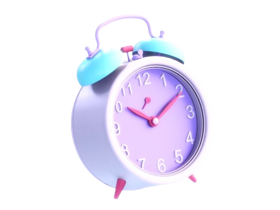

# CountdownTimer - TechnoHacks

## Aim
To create a countdown timer that counts down from a set time to zero, with options to stop, reset, and restart the timer.

## Program
In timer.html
```
<!DOCTYPE html>
<html lang="en">
<head>
    <meta charset="UTF-8">
    <meta name="viewport" content="width=device-width, initial-scale=1.0">
    <link rel="icon" href="icon.jpg">
    <link rel="stylesheet" href="style.css">
    <title>Countdown Timer</title>
</head>
<body>
    <div class="timer-container">
        <table border="3">
            <tr class="rowlayout">
        <th colspan="3"><div id="timer">00:00:00</div></th>
            </tr>
            <tr>
                <td><button class="btnlayout" onclick="startTimer()">Start</button></td>
                <td><button class="btnlayout" onclick="stopTimer()">Stop</button></td>
                <td><button class="btnlayout" onclick="resetTimer()">Reset</button></td>
            </tr>
        </table>
    </div>
    <script src="script.js"></script>
</body>
</html>
```

In style.css
```
body {
  align-items: center;
  justify-content: center;
  height: 100%;
  width: 99%;
  margin: 10;
  background-color: lavender;
}
.timer-container {
  text-align: center;
}

.btnlayout {
  width: 154px;
  height: 50px;
  color: black;
  background-color: lightpink;
  border-radius: 4px;
}

.rowlayout {
  height: 525px;
}

#timer {
  font-size: 2em;
  margin-bottom: 20px;
  color: black;
}

table{
  width: 100%;
  height: 100%;
}
```
In script.js
```
let timer;
let timeInSeconds = 0; // Start from 0 seconds

function formatTime(seconds) {
    const hours = Math.floor(seconds / 3600);
    const minutes = Math.floor((seconds % 3600) / 60);
    const remainingSeconds = seconds % 60;

    return `${String(hours).padStart(2, '0')}:${String(minutes).padStart(2, '0')}:${String(remainingSeconds).padStart(2, '0')}`;
}

function updateTimerDisplay() {
    document.getElementById('timer').textContent = formatTime(timeInSeconds);
}

function startTimer() {
    if (!timer) {
        timer = setInterval(function () {
            timeInSeconds++;
            updateTimerDisplay();
        }, 1000);
    }
}

function stopTimer() {
    clearInterval(timer);
    timer = null;
}

function resetTimer() {
    stopTimer();
    timeInSeconds = 0;
    updateTimerDisplay();
}
```

## Output
